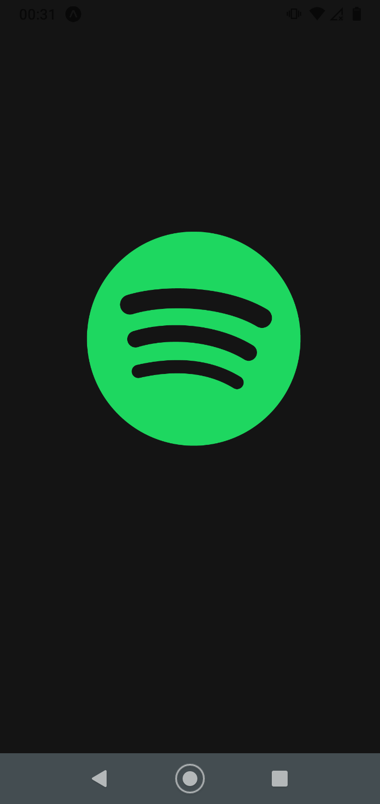

<p align="center">

<a href="https://github.com/RonaldGuilhermePDS/ExpoTify">


</a>

<h2 align="center">Welcome!</h2>

<p align="center">
<a href="https://discord.com">Spotify</a> UI Clone with <a
href="https://github.com/facebook/react-native">React Native</a> Framework and <a
href="https://github.com/expo/expo">Expo</a> Platform Execution
</p>

<p align="center"><a href="https://github.com/RonaldGuilhermePDS/ExpoTify/find/master"><strong><- Explore the docs -></strong></a></p>

<p align="center">
<a href="https://github.com/RonaldGuilhermePDS">Creator</a>
·
<a href="https://github.com/RonaldGuilhermePDS/ExpoTify/issues">Report Bug</a>
·
<a href="https://github.com/RonaldGuilhermePDS/ExpoTify/pulls">Request Feature</a>
</p>

<details open="open">
<summary>Table of Contents</summary>
<ol>
<li>
<a href="#about">About</a>
<ul>
<li><a href="#built-with">Built With</a></li>
</ul>
</li>
<li>
<a href="#getting-started">Getting Started</a>
<ul>
<li><a href="#prerequisites">Prerequisites</a></li>
<li><a href="#installation">Installation</a></li>
</ul>
</li>
<li><a href="#screenshots">Screenshots</a></li>
<li><a href="#contributing">Contributing</a></li>
<li><a href="#license">License</a></li>
</ol>
</details>

## About

<a href="https://github.com/RonaldGuilhermePDS/ExpoTify">ExpoTify</a> is a **Project** that aims to clone the **Spotify Interface** to improve my **Skills**. 

## Built With

* [Node JS](https://github.com/nodejs/node)
* [React Native](https://github.com/facebook/react-native)
* [Expo](https://github.com/expo/expo)
* [My JSON Server](https://my-json-server.typicode.com)

## Getting Started

Follow the instructions to start the project without any problems.

## Prerequisites

* Expo
```sh
npm install --global expo-cli
```
## Installation

1. Clone the Repository
```sh
git clone https://github.com/RonaldGuilhermePDS/ExpoTify.git
```
2. Install Packages
```sh
npm install or yarn install
```
3. Run
```sh
npm start or yarn start
```

## Screenshots

Demo|Home Screen|Splash Screen
:-------------------------:|:-------------------------:|:-------------------------: 
||

## Contributing

Contributions are what make the open source community such an amazing place to be learn, inspire, and create. Any contributions you make are **greatly appreciated**.

1. Fork the Project
2. Create your Feature Branch (`git checkout -b feature/AmazingFeature`)
3. Commit your Changes (`git commit -m 'Add some AmazingFeature'`)
4. Push to the Branch (`git push origin feature/AmazingFeature`)
5. Open a Pull Request

## License

Distributed under the **MIT License**.

```LICENSE
MIT License

Copyright (c) 2021 Ronald Guilherme P. dos Santos

Permission is hereby granted, free of charge, to any person obtaining a copy
of this software and associated documentation files (the "Software"), to deal
in the Software without restriction, including without limitation the rights
to use, copy, modify, merge, publish, distribute, sublicense, and/or sell
copies of the Software, and to permit persons to whom the Software is
furnished to do so, subject to the following conditions:

The above copyright notice and this permission notice shall be included in all
copies or substantial portions of the Software.

THE SOFTWARE IS PROVIDED "AS IS", WITHOUT WARRANTY OF ANY KIND, EXPRESS OR
IMPLIED, INCLUDING BUT NOT LIMITED TO THE WARRANTIES OF MERCHANTABILITY,
FITNESS FOR A PARTICULAR PURPOSE AND NONINFRINGEMENT. IN NO EVENT SHALL THE
AUTHORS OR COPYRIGHT HOLDERS BE LIABLE FOR ANY CLAIM, DAMAGES OR OTHER
LIABILITY, WHETHER IN AN ACTION OF CONTRACT, TORT OR OTHERWISE, ARISING FROM,
OUT OF OR IN CONNECTION WITH THE SOFTWARE OR THE USE OR OTHER DEALINGS IN THE
SOFTWARE.
```
